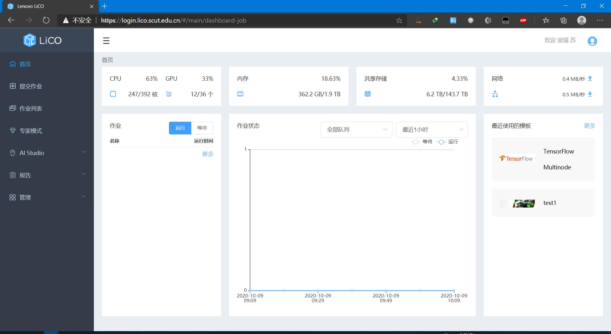

# 简介

欢迎使用华南理工大学高性能计算平台。

## 界面概述

**集群资源监控**：首页的仪表板，用于监控集群资源（包括 CPU、内存、存储和网络） 的使用情况。

**作业模板**：华南理工大学高性能计算平台提供多个作业模板（包括 HPC 和 AI 作业模板），用于帮助用户通过 Web 页面方便地提交作业。

**定制模板**：用户可创建自己的作业模板来为其他 HPC 和 AI 应用程序提供支持。 

**作业管理和监控**：用户可直接查看和管理作业的状态和结果。支持多种常用调度程序和丰富的 作业类型（包括 AI 作业，如 TensorFlow 和 Caffe）。 

**容器映像管理**：平台为支持的每种 AI 框架提供系统容器映像。用户可上传专用图片和对其运 行 AI 或 HPC 作业。 

**专家模式**：平台提供用于提交和管理作业的命令行工具，用户可通过其他 shell 工具登录到登录节点并执行命令。

## 专业术语

**计算机集群**：通常指的是服务器资源的集合，包括管理节点、登录节点和计算节点 • 作业：为了完成特定任务按顺序执行的一系列命令

**作业状态**：调度系统中的作业状态，如正在等待、队列、保持、运行中、已冻结和已完成 • 节点状态：节点的状态，如空闲、忙碌或已关闭

**作业调度系统**：用于控制作业的接收、分发、执行和注册的分布式程序，也称为操作调度程序 或简单调度程序

**管理节点**：集群中运行管理程序（如作业调度、集群管理和用户计费）的服务器

**登录节点**：集群中用户可通过 Linux 登录并执行操作的服务器 • 计算节点：集群中用于执行作业的服务器

**用户组**：系统已为其定义了访问控制策略的一组用户，目的是让同一用户组中的所有用户可以 访问同一组集群资源

**计费组**：同一个账户下的一组待收费的集群用户，也称为计费账户。一个计费账户中可以包含 一个用户，也可以包含多个用户

**NGC 映像**：适用于 Docker 的 NVIDIA 容器运行时，也称为 nvidia-docker。它支持基于 GPU 且可在多个机器之间移植的应用程序。方法是使用 Docker 容器。

