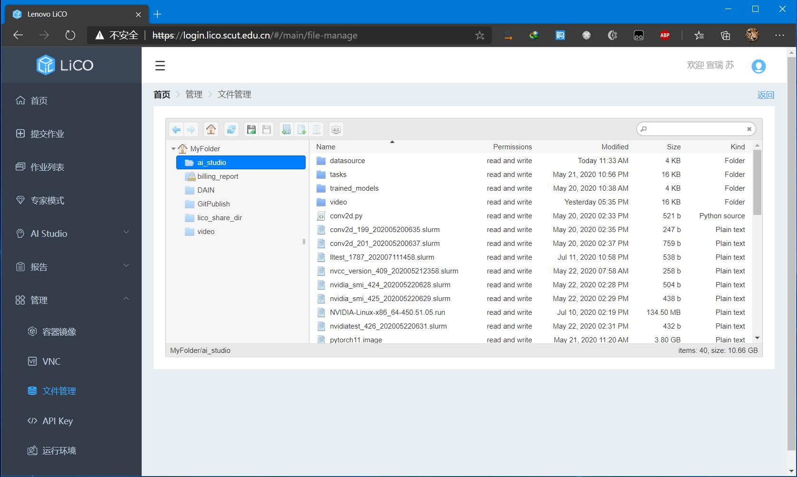
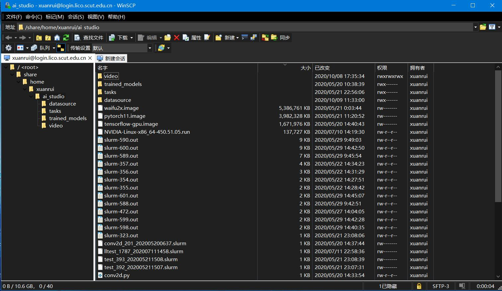

# 文件管理

## 通过网页端在线管理

点击管理-文件管理，即可管理用户资源文件，可以实现上传、下载、删除、重命名等基本操作。


网页版的文件管理有诸多限制，例如上传文件无法中断、无法断点续传、无法多选文件批量处理等，推荐使用SSH方式连接。


## 通过SSH远程连接

用您熟悉的SSH远程文件管理工具（例如WinSCP），使用登录账号远程到登录节点（login.lico.scut.edu.cn），打开用户资源目录

